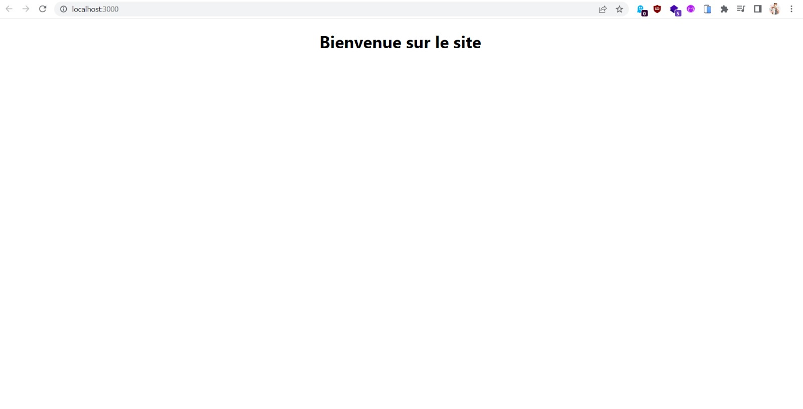

#   Systeme de route

##  Premiere etape


Apres la creation du dossier, il faut utiliser la commande suivante : 
```powershell
    PS D:\react-router>  npm create react-router-dom
```


A la fin si l'installation s'est bien passer on devrait retrouver ceci dans le fichier package.json

```json
    "dependencies": {
        
        //#...
        "react-dom": "^18.2.0",
        // La version de React routeur dom peut etre differente
        "react-router-dom": "^6.4.1",
    },
```

## Seconde etape

Importer dans index.js le Browser router

```jsx
    import {BrowserRouter} from 'react-router-dom'
```


Il faut aussi englobé le contenue avec le browser  router : 

```jsx
root.render(

    <BrowserRouter>
        <App />
    </BrowserRouter>,

    document.getElementById('root')
);
```

## Troisieme etape

pour commencer a l'utiliser on poeut aller dans app.js et importer :

```jsx
    import {Routes,Route} from "react-router-dom"
```


puis dans la contenue : 

```jsx
    function App() {
        return (
            <div className="App">
                <Routes>
                    <Route 
                    // Indique la route concerné
                        path="/" 
                        // Indique l'element  a affiché sur cette route
                        element={<Home/>}
                        >
                    </Route>
                </Routes>
            </div>
        );
    }
```

le composant Home contient ceci : 

```jsx
    import React from 'react'

    export default function Home() {
        return (
            <h1>Bienvenue sur le site</h1>
        )
    }

```

## Rendu final 

En lançant **npm start** , le rendu sera le suivant : 



